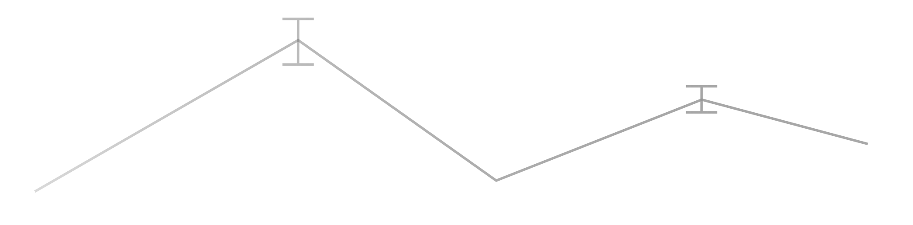

# RewardUQ: Uncertainty-Aware Reward Models



[](https://opensource.org/licenses/Apache-2.0)
[](https://www.python.org/downloads/)
[](https://pytorch.org/)
[](https://github.com/lasgroup/rewarduq/actions/workflows/tests.yml)

## Updates

- 12.11.2025: We have been accepted to the EIML workshop @ EurIPS 2025!

## Introduction

**RewardUQ** is a unified framework for training and evaluating uncertainty-aware reward models. Built on top of the Hugging Face ecosystem using [🤗 TRL](https://github.com/huggingface/trl), [🤗 Transformers](https://github.com/huggingface/transformers), and [PyTorch](https://github.com/pytorch/pytorch), it provides a variety of state-of-the-art uncertainty quantification methods alongside easily accessible training pipelines.

This repository is designed to function simultaneously as an **importable library** and a **standalone research framework**. We want to encourage both usage styles to foster adoption and contribution from the community.

- 📦 **As library:** Import specific components (models, functional APIs, utilities) into external projects or production inference pipelines.

- 🧪 **As research framework:** Use Hydra configurations and entry points for rapid experimentation with version-controllable configs and seamless hyperparameter sweeps.

## Available Methods

| Method | Description | Config Path |
|--------|-------------|-------------|
| **MLP Head Ensemble** | Multiple independent MLP heads on a shared frozen backbone. Uncertainty from prediction variance across ensemble members. | [`mlp_head_ensemble/`](./configs/method/mlp_head_ensemble/) |
| **LoRA Ensemble** | Ensemble of independent LoRA adapters, each with its own linear head. | [`lora_ensemble/`](./configs/method/lora_ensemble/) |
| **DPO-based MC Dropout** | Monte Carlo dropout applied to DPO's implicit reward model. Uncertainty from stochastic forward passes during inference. | [`dpo_head_dropout_ensemble/`](./configs/method/dpo_head_dropout_ensemble/) |
| **Bayesian Linear Head** | Single linear head with Gaussian posterior via Laplace approximation. | [`bayesian_linear_head/`](./configs/method/bayesian_linear_head/) |

## Installation

### Python package

Install the package via [pip](https://pip.pypa.io/en/stable/):

```bash
pip install rewarduq
```

### Repository

Clone the repository:

```bash
git clone https://github.com/Florian-toll/rewarduq.git
cd rewarduq
```

We recommend [uv](https://docs.astral.sh/uv/) to manage dependencies:

```bash
uv sync
```

Alternatively, use pip with the `requirements.txt`:

```bash
pip install -r requirements.txt
```

After the installation verify that torch recognizes your device. If you have a CUDA-capable GPU, the following command should return `True`, otherwise make sure to install the correct version of PyTorch for your system from [pytorch.org](https://pytorch.org/get-started/locally/):

```bash
uv run python -c "import torch; print(torch.cuda.is_available())"
```

### Development setup

```bash
# Install dev dependencies
uv sync --dev

# Or, install all extras
uv sync --all-extras

# Optionally, install pre-commit hooks (recommended)
uv run pre-commit install

# Optionally, install nbstripout hooks (recommended)
uv run nbstripout --install
```

Run the pre-commit hooks manually with:

```bash
uv run pre-commit run --all-files
```

## Quick start

### Using the library

```python
from rewarduq import load_pipeline
from rewarduq.utils import get_config

# Load the config
config = get_config("configs/<config_file>.yaml")

# Load the pipeline
rm_pipeline = load_pipeline(config)

# Train the reward model
rm_pipeline.train(train_dataset, eval_dataset)
```

All forward passes of RewardUQ models return a tensor of shape `(batch_size, 3)` where the first column is the reward, the second column is the lower bound, and the third column is the upper bound.

### Using the CLI

RewardUQ uses [Hydra](https://hydra.cc/) for configuration management. For example, to train a model you can use the following command:

```bash
uv run python ./scripts/train.py \
  dataset/train=ultrafeedback_binarized \
  dataset/eval=ultrafeedback_binarized \
  method=mlp_head_ensemble/default \
  model.base_model_name_or_path=Qwen/Qwen3-0.6B
```

By default this uses the [`configs/`](./configs/) folder in the repository and the [`train.yaml`](./configs/train.yaml) file. If you run experiments outside of the installed the repository, you must specify the `--config-path <absolute_config_path>` parameter. You can also change the config file with the `--config-name <config_name>` parameter, for instance to manage multiple experiments at once.

### RewardBench evaluation

In our paper, we use [RewardBench](https://github.com/allenai/reward-bench) as our primary evaluation benchmark. To evaluate on RewardBench with automatic weighted averaging over categories, use the following config override:

```bash
dataset/eval=reward_bench
```

## Scripts

### Training: `scripts/train.py`

Train uncertainty-aware reward models using Hydra configuration.

**Usage:**
```bash
uv run python ./scripts/train.py \
  dataset/train=<train_dataset> \
  dataset/eval=<eval_dataset> \
  method=<method_config> \
  [additional_overrides...]
```

**Key Parameters:**
- `dataset/train`: Training dataset configuration (e.g., `ultrafeedback_binarized`, `tulu_3_8b_preference_mixture`)
- `dataset/eval`: Evaluation dataset configuration (can be `null` for no evaluation)
- `method`: UQ method configuration (e.g., `mlp_head_ensemble/default`)
- `model.base_model_name_or_path`: HuggingFace model identifier or local path
- `resume`: Resume from checkpoint (path or `True` for latest)

**Examples:**
```bash
# Train MLP Head Ensemble on Qwen3-0.6B
uv run python ./scripts/train.py \
  dataset/train=ultrafeedback_binarized \
  dataset/eval=ultrafeedback_binarized \
  method=mlp_head_ensemble/qwen3_0.6b
```

To enable logging, set `trainer.report_to=wandb`. You can also override the entity and project directly in the command:

```bash
wandb login

# Run training
uv run python ./scripts/train.py \
  trainer.report_to=wandb \
  wandb.entity=your-entity \
  wandb.project=your-project
```

To run hyperparameter sweeps using for example the configs in [`configs/sweeps/`](./configs/sweeps/):

```bash
# Create sweep
wandb sweep \
  --entity <your-entity> \
  --project <your-project> \
  --name <your-sweep-name> \
  ./configs/sweeps/sweep_ens_mlp.yaml

# Run sweep
wandb agent --count 1 "<your-entity>/<your-project>/<sweep-id>"
```

### Inference: `scripts/run_inference.py`

Run inference on custom prompts and completions.

**Usage:**
```bash
python ./scripts/run_inference.py \
  --model <model_path> \
  --dataset <dataset_name> <split> \
  [--batch-size BATCH_SIZE] \
  [--out OUTPUT_DIR] \
  [--debug]
```

**Parameters:**
- `--model`: Path to trained model or HuggingFace identifier (required)
- `--dataset`: Dataset containing prompts and completions (required)
- `--batch-size`: Inference batch size (default: 16)
- `--out`: Output directory for predictions (default: current directory)
- `--debug`: Limit dataset size for quick testing

**Output:**
Saves predictions as `.npy` files containing reward scores with uncertainty bounds.

## Configuration Structure

Configs are organized in the [`configs/`](./configs/) directory:

```
configs/
├── train.yaml              # Main training config with defaults
├── dataset/
│   ├── train/              # Training dataset configs
│   │   ├── ultrafeedback_binarized.yaml
│   │   ├── tulu_3_8b_preference_mixture.yaml
│   │   └── ...
│   └── eval/               # Evaluation dataset configs
│       ├── reward_bench.yaml
│       └── ...
├── method/
│   ├── base.yaml           # Base config for all methods
│   ├── mlp_head_ensemble/
│   │   ├── default.yaml    # Default config
│   │   ├── qwen3_14b.yaml  # Model-specific tuned config
│   │   └── ...
│   ├── lora_ensemble/
│   ├── dpo_head_dropout_ensemble/
│   └── bayesian_linear_head/
├── accelerate/             # Examples for distributed training configs
│   ├── default.yaml
│   └── fsdp.yaml
├── paths/                  # Path configurations
│   └── default.yaml
└── hydra/                  # Hydra-specific settings
    └── default.yaml
```

## Architecture

**Models** inherit from `transformers.PreTrainedModel`:
```
transformers.PreTrainedModel
    └── rewarduq.methods.base.RewardUQModel (base class for all UQ models)
        ├── MLPHeadEnsembleModel
        ├── LoraEnsembleModel
        ├── DPOHeadDropoutEnsembleModel
        └── BayesianLinearHeadModel
```

**Trainers** extend TRL's specialized trainers:
```
transformers.Trainer
    └── trl.RewardTrainer / trl.DPOTrainer
        └── rewarduq.trainers.TrainerExtension (adds UQ-specific features)
            ├── rewarduq.trainers.RewardUQTrainer (extends RewardTrainer)
            └── rewarduq.trainers.DPORewardUQTrainer (extends DPOTrainer)
```

All forward passes of RewardUQ models return a tensor of shape `(batch_size, 3)` where the first column is the reward, the second column is the lower bound, and the third column is the upper bound.

## Contributing

We welcome and encourage contributions from the community! Whether you want to add a new uncertainty quantification method, improve existing ones, or fix bugs, your help is appreciated. If you have an idea for a new feature or improvement:

1. Check existing [Issues](https://github.com/lasgroup/rewarduq/issues) or open a new one to discuss your idea.
2. Fork the repository and create a feature branch.
3. Implement your changes (don't forget tests :D).
4. Submit a [Pull Request](https://github.com/lasgroup/rewarduq/pulls).

## Citation

```bibtex
@misc{yang2025rewarduq,
  author = {Daniel Yang and Samuel Stante and Florian Redhardt and Lena Libon and Barna Pasztor and Parnian Kassraie and Ido Hakimi and Andreas Krause},
  title = {RewardUQ: A Unified Framework for Uncertainty-Aware Reward Models},
  year = {2025},
  publisher = {GitHub},
  journal = {GitHub repository},
  howpublished = {\url{https://github.com/lasgroup/rewarduq}}
}
```

## License

This repository's source code is available under the [Apache-2.0 License](LICENSE).
